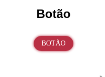
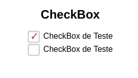
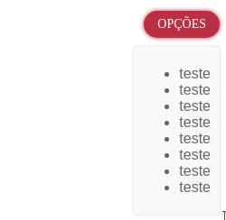
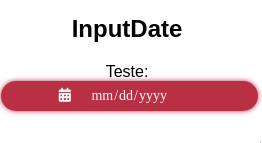
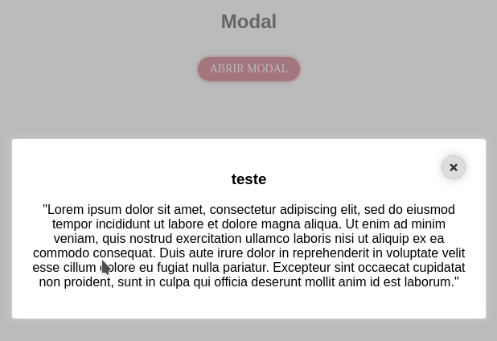
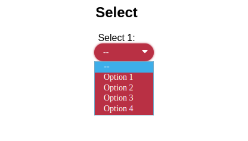
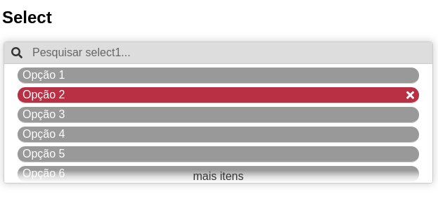
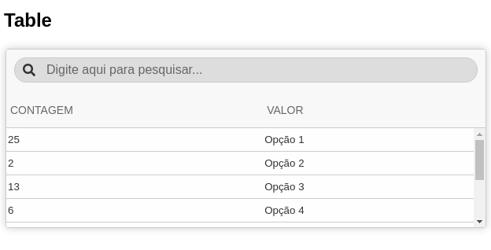
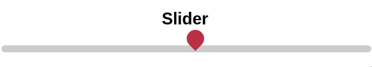
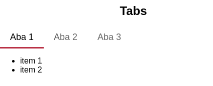

# React Atenas Components

Esta biblioteca possui os componentes utilizados em projetos da Atenas Software.

Utilização:

Instale através do npm:

```npm install react-atenas-components```


## Button



```jsx
import { Button } from "react-atenas-components";

class App extends React.Component {
  onClick = () => {
    window.alert("Clicado");
  };

  render() {
    return (
      <div className="App">
        <h2>Botão</h2>
        <Button disabled={false} onClick={this.onClick}>
          Botão
        </Button>
      </div>
    );
  }
}
```
[](https://codesandbox.io/s/5v4l6445xl)

Props 

onClick, children, className, disabled

| Props     | Descrição                                                 |
| --------- | --------------------------------------------------------- |
| onClick   | Função do evento ao pressionar o botão                    |
| children  | O conteúdo do botão                                       |
| className | Classes adicionais a adicionar no botão                   |
| disabled  | Booleano que descreve se o botão está desabilitado ou não |
| icon      | Icone do font-awesome do botão                            |


## CheckBox



```jsx
import { CheckBox } from "react-atenas-components";

class App extends React.Component {
  state = {
    teste1: true,
    teste2: false
  };

  checkEm = (event, nome) => {
    this.setState({
      [nome]: event.target.checked
    });
  };

  render() {
    return (
      <div className="App">
        <h2>CheckBox</h2>
        <CheckBox
          onChange={e => this.checkEm(e, "teste1")}
          value={this.state.teste1}
          name="teste1"
          titulo="CheckBox de Teste"
        />
        <CheckBox
          onChange={e => this.checkEm(e, "teste2")}
          value={this.state.teste2}
          name="teste2"
          titulo="CheckBox de Teste"
        />
      </div>
    );
  }
}
```
[](https://codesandbox.io/s/wn5wjny5j7)


Props 


| Props     | Descrição                                                          |
| --------- | ------------------------------------------------------------------ |
| name      | Identificador único do componente                                  |
| onClick   | Função que define a ação a ser efetuada quando o botão for clicado |
| className | Classe adicional a ser passada para o componente                   |
| titulo    | Nome exibido do componente                                         |


## DropDown



```jsx
import { DropDown } from "react-atenas-components";

class App extends React.Component {
  render() {
    return (
      <div className="App">
        <h2>Botão</h2>
        <DropDown title="Opções">
          <ul>
            <li>teste</li>
            <li>teste</li>
            <li>teste</li>
            <li>teste</li>
            <li>teste</li>
            <li>teste</li>
            <li>teste</li>
            <li>teste</li>
          </ul>
        </DropDown>
      </div>
    );
  }
}
```
[](https://codesandbox.io/s/myl4086o8y)

| Props | Descrição       |
| ----- | --------------- |
| title | título do botão |


## InputDate



```jsx
import { InputDate } from "react-atenas-components";

class App extends React.Component {
  state = {
    date: new Date()
  };

  onChange = (e, filtro) => {
    this.setState({
      [filtro]: e.target.value
    });
    alert(e.target.value);
  };

  render() {
    return (
      <div className="App">
        <h2>InputDate</h2>
        <InputDate
          filtro="date"
          label="Teste"
          onChange={this.onChange}
          value={this.state.value}
        />
      </div>
    );
  }
}
```

[](https://codesandbox.io/s/q339z6yz8q)

| Props    | Descrição                             |
| -------- | ------------------------------------- |
| filtro   | identificador unico do input          |
| label    | texto a ser exibido no label do input |
| onChange | evento de mudança de valor            |
| value    | valor do input                        |


## Modal



```jsx
import { Button, Modal } from "react-atenas-components";

class App extends React.Component {
  state = {
    open: false
  };

  onToggle = async () => {
    await this.setState({ open: !this.state.open });
  };

  render() {
    return (
      <div className="App">
        <h2>Modal</h2>
        <Button onClick={this.onToggle}>
          Abrir Modal
        </Button>
        <Modal open={this.state.open} onClose={this.onToggle}>
          <div>
            <h3>teste</h3>
            <p>
              Lorem ipsum dolor sit amet, consectetur adipiscing elit, sed do
              eiusmod tempor incididunt ut labore et dolore magna aliqua. Ut
              enim ad minim veniam, quis nostrud exercitation ullamco laboris
              nisi ut aliquip ex ea commodo consequat. Duis aute irure dolor in
              reprehenderit in voluptate velit esse cillum dolore eu fugiat
              nulla pariatur. Excepteur sint occaecat cupidatat non proident,
              sunt in culpa qui officia deserunt mollit anim id est laborum.
            </p>
          </div>
        </Modal>
      </div>
    );
  }
}
```
[](https://codesandbox.io/s/y2rwnwvllj)


| Props   | Descrição                                         |
| ------- | ------------------------------------------------- |
| open    | booleano que define se o modal está aberto ou não |
| onClose | callback para fechar o modal                      |


## Select



```jsx
import { Select } from "react-atenas-components";

class App extends React.Component {
  state = {
    selected: null
  };

  onChange = (val) => {
    this.setState({
      selected: val
    })
  };

  render() {
    const options = [
      {
        value: 1,
        label: "Option 1"
      },
      {
        value: 2,
        label: "Option 2"
      },
      {
        value: 3,
        label: "Option 3"
      },
      {
        value: 4,
        label: "Option 4"
      }
    ]

    return (
      <div className="App">
        <h2>Select</h2>
        <Select
          options={options}
          filtro="select1"
          label="Select 1"
          onChange={this.onChange}
          value={this.state.selected}
          required={false}
          line={false}
        />
      </div>
    );
  }
}
```
[](https://codesandbox.io/s/zx55noon8l)

| Props    | Descrição                                                             |
| -------- | --------------------------------------------------------------------- |
| options  | Opções da seleção (devem ser objetos com campos value e label)        |
| filtro   | identificador único do select                                         |
| label    | label do input                                                        |
| onChange | callback de mudança do valor                                          |
| value    | Valor do input                                                        |
| required | Se for verdadeiro o select não permite selecionar um valor indefinido |
| line     | se o label fica na mesma linha ou fica acima do input                 |


## SelectList



```jsx
import { SelectList } from "react-atenas-components";

class App extends React.Component {
  state = {
    select1: null
  };

  onChange = (filtro, val) => {
    this.setState({
      [filtro]: val
    });
  };

  render() {
    const options = [
      {
        count: 25,
        value: "Opção 1"
      },
      {
        count: 2,
        value: "Opção 2"
      },
      {
        count: 13,
        value: "Opção 3"
      },
      {
        count: 6,
        value: "Opção 4"
      },
      {
        count: 10,
        value: "Opção 5"
      },
      {
        count: 10,
        value: "Opção 6"
      },
      {
        count: 10,
        value: "Opção 7"
      },
      {
        count: 10,
        value: "Opção 8"
      }
    ];

    return (
      <div className="App">
        <h2>Select</h2>
        <SelectList
          onSelectFiltro={this.onChange}
          filtro="select1"
          selecionado={this.state.select1}
          list={options}
        />
      </div>
    );
  }
}
```
[](https://codesandbox.io/s/9jm34129lo)

| Props          | Descrição                                            |
| -------------- | ---------------------------------------------------- |
| onSelectFiltro | Callback quando um item é clicado                    |
| filtro         | Identificador único da lista                         |
| selecionado    | Valor selecionado da lista                           |
| list           | lista de opções com objetos com campos value e count |

## Table



```jsx
import { Table } from "react-atenas-components";

class App extends React.Component {
  state = {
    select1: null
  };

  onChange = (filtro, val) => {
    this.setState({
      [filtro]: val
    });
  };

  render() {
    const options = [
      {
        count: 25,
        value: "Opção 1"
      },
      {
        count: 2,
        value: "Opção 2"
      },
      {
        count: 13,
        value: "Opção 3"
      },
      {
        count: 6,
        value: "Opção 4"
      },
      {
        count: 10,
        value: "Opção 5"
      },
      {
        count: 10,
        value: "Opção 6"
      },
      {
        count: 10,
        value: "Opção 7"
      },
      {
        count: 10,
        value: "Opção 8"
      }
    ];

    const columns = [
      { label: 'Contagem', key: 'count', width: '40%' },
      // { label: 'Valor Dinheiro', key: 'value', width: '30%', format: 'money' },
      { label: 'Valor', key: 'value', width: '30%' },
    ]

    return (
      <div className="App" style={{ flexDirection: 'column', display: 'flex', minHeight: '300px', justifyContent: 'stretch' }}>
        <h2>Table</h2>
        <Table
          list={options}
          columns={columns}
        />
      </div>
    );
  }
}
```
[](https://codesandbox.io/s/p95rj0yv0j)

### Columns Prop
| Columns Prop | Descrição                                                                                                            |
| ------------ | -------------------------------------------------------------------------------------------------------------------- |
| label        | descrição no header da coluna                                                                                        |
| title        | Hint que aparece ao deixar o mouse sobre a coluna                                                                    |
| key          | chave do valor na lista                                                                                              |
| width        | largura da coluna                                                                                                    |
| callback     | callback ao editar a coluna (se for editável)                                                                        |
| idKey        | identificador da linha sendo alterada                                                                                |
| type         | tipo do input (se for editável) (pode ser 'number', 'text', 'date', 'datetime-local', 'email', 'month' e 'checkbox') |
| render       | calback de render que sobrescreve o que é exibido na coluna                                                          |
| format       | formatação especial da coluna ('date', 'boolean', money)                                                             |
| filter       | filtro gerado automaticamente com os dados da coluna ('select', 'date')                                              |


| Props          | Descrição                                                                                 |
| -------------- | ----------------------------------------------------------------------------------------- |
| columns        | lista de colunas como descrito acima                                                      |
| list           | lista de elementos a serem exibidos                                                       |
| printable      | se verdadeiro, exibe um botão para imprimir os dados da tabela                            |
| renderHeader   | (se printable for verdadeiro) header a ser exibido na impressão                           |
| serverside     | se verdadeiro a pesquisa requer um callback e um valor para funcionar do lado do servidor |
| searchCallback | callback de pesquisa                                                                      |
| searchValue    | valor da pesquisa                                                                         |
| loading        | exibe status de carregamento no final da lista (true/false)                               |
| onScrollEnd    | callback ao atingir o final da lista                                                      |


## Loading 


```jsx
import { Loading } from "react-atenas-components";

class App extends React.Component {
  render() {
    return (
      <div className="App">
        <h2>Loading</h2>
        <Loading message="Carrengando as paradas ae" />
      </div>
    );
  }
}
```

[](https://codesandbox.io/s/4258mk8yv9)


| Props   | Descrição                                                    |
| ------- | ------------------------------------------------------------ |
| message | Mensagem opcional que aparece acima do icone de carregamento |

## SearchBar

```jsx
import { SearchBar } from "react-atenas-components";

class App extends React.Component {
  state = {
    search: ""
  };

  onType = e => {
    this.setState({
      search: e.target.value
    });
  };

  render() {
    return (
      <div className="App">
        <h2>Loading</h2>
        <SearchBar
          searchCallback={this.onType}
          value={this.state.search}
          placeholder="Digite aqui para pesquisar"
          small={false}
        />
      </div>
    );
  }
}
```
[](https://codesandbox.io/s/z29919qrvp)

| Props          | Descrição                                     |
| -------------- | --------------------------------------------- |
| searchCallback | callback ao digitar na barra                  |
| value          | valor do campo                                |
| placeholder    | placeholder exibido quando a barra está vazia |
| small          | se verdadeiro mostra uma barra menor          |

## Slider 



```jsx
import { Slider } from "react-atenas-components";

class App extends React.Component {
  state = {
    slider: 100
  };

  checkEm = (event, nome) => {
    this.setState({
      [nome]: event.target.checked
    });
  };

  render() {
    return (
      <div className="App">
        <h2>Slider</h2>
        <Slider
          min={80}
          max={120}
          value={this.state.slider}
          onChange={slider => this.setState({ slider })}
          onMouseUp={slider => this.setState({ slider })}
        />
      </div>
    );
  }
}
```
[](https://codesandbox.io/s/v0kok40vp5)

| Props     | Descrição                                    |
| --------- | -------------------------------------------- |
| min       | Valor mínimo do Slider                       |
| max       | Valor máximo do Slider                       |
| value     | Valor atual do Slider                        |
| onChange  | Callback do evento de movimentação do slider |
| onMouseUp | Callback do evento de "Soltar o slider"      |


## Tabs



```jsx
import { Tabs } from "react-atenas-components";

class App extends React.Component {
  state = {
    slider: 100
  };

  checkEm = (event, nome) => {
    this.setState({
      [nome]: event.target.checked
    });
  };

  render() {
    return (
      <div className="App">
        <h2>Slider</h2>
        <Tabs>
          <div label="Aba 1">
            <ul>
              <li>item 1</li>
              <li>item 2</li>
            </ul>
          </div>
          <div label="Aba 2">
            <ul>
              <li>asdfasdf</li>
              <li>asdfadsfasdf</li>
            </ul>
          </div>
          <div label="Aba 3">Batata</div>
        </Tabs>
      </div>
    );
  }
}
```
[](https://codesandbox.io/s/vjr8y67xy3)

Os filhos do componente Tabs devem ser ```div``` que contém uma prop ```label```, esta prop é utilizada para o título da aba


## Input

```jsx
import { Input } from "react-atenas-components";

class App extends React.Component {
  state = {
    text: ""
  };

  onType = e => {
    this.setState({
      text: e.target.value
    });
  };

  render() {
    return (
      <div className="App">
        <h2>Loading</h2>
        <Input
          searchCallback={this.onType}
          value={this.state.text}
          placeholder="Placeholder"
        />
      </div>
    );
  }
}
```

| Props          | Descrição                                     |
| -------------- | --------------------------------------------- |
| searchCallback | callback ao digitar no input                  |
| value          | valor do campo                                |
| placeholder    | placeholder exibido quando o input está vazio |
| small          | se verdadeiro mostra uma barra menor          |
| icon           | Icone do lado esquerdo                        |
